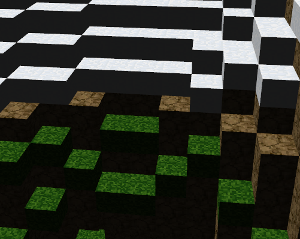
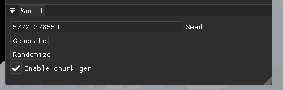
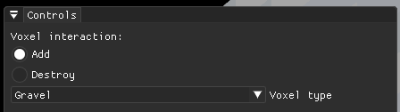
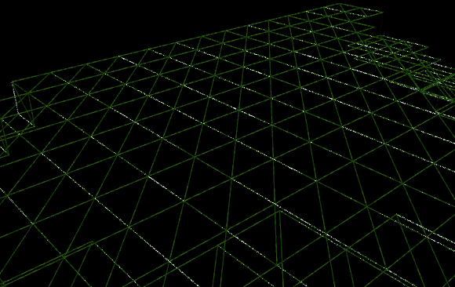

# Minecraft thingy
## How to run
Either use `cmake` to build the project or use `exe` in `bin/`. If you wish to use the `exe` follow instructions 
in `bin/README.md`.

A simple overview of how the 'game' is implemented:

### Voxels
Voxels are based on integral grid in world space. There are 5 types, one of them being 'Empty'.  Type of the 
voxel is based on values generated by a perlin noise generator. Grass is used in upper layer (ice in high altitudes),
gravel can be only found underground.

### Chunks
The world is divided into chunks. These chunks are un/loaded based on distance from camera. Upon changing types of voxel - by generating them or being 
modified by the user - a new mesh for the chunk is generated. 
__
Each chunk holds a log of its modifications. This is the only part being saved when the chunk is unloaded or saved to
disk. Originally I had created a binary format to save world data, due to not having enough time to fix bugs 
I was forced to use inefficient JSON.

Changes are persistent across chunk unloading and disk saving. The world can be generated from a different seed or
randomized.

### Player interaction
The player can interact with the world by adding new voxels next to already generated ones. They can also
destroy voxels.

## Possible improvements
### Better mesh generation
* In the current implementation a lot of memory is wasted on flat areas, which could be rendered by a single quad:

* The mesh is also generated on each side of the chunk regardless of voxels in the neighboring chunk. No vertices need to be generated in this case, which would lead to lowering memory usage.
* Current mesh doesn't use indices, so there are many redundant vertices = greater memory usage.
###  Occlusion culling
Many of the generated chunks are not visible due to being occluded by others. Implementing occlusion culling would lead to performance improvements.

### Chunk streaming
To lessen memory usage chunk data could be stored on hard drive and streamed into memory when needed. This would require implementing better serialization than the one implemented currently.

### Level of detail
If the aim of the project was to render very distant areas then level of detail would be necessary. It could be implemented simply by using bigger voxels on distant chunks.

### Proper player&world collision
Due to time constraints the player->world collision is very rudimentary. The collision could be implemented simply by using an AABB for the player and calculating world intersection.

### Visual improvements
Obviously it would really help to implement shadows and light sources.